# DIY NFC Scanner

This guide explains how to create a low cost NFC scanner using easily available
parts, which is guaranteed to be compatible with the [nfc](/docs/nfc.md) script
on MiSTer. The total cost of a single scanner is approximately $10 USD in a
small batch of 5.

This guide, the serial PCB design and case 3D model are all open source and
distributed under the
[CC BY-SA 4.0](https://creativecommons.org/licenses/by-sa/4.0/) license. Anyone
is welcome and encouraged to use, remix and sell their own scanners. The
intention of this project is to make reliable NFC scanners more accessible,
additional contributions and improvements are welcome!

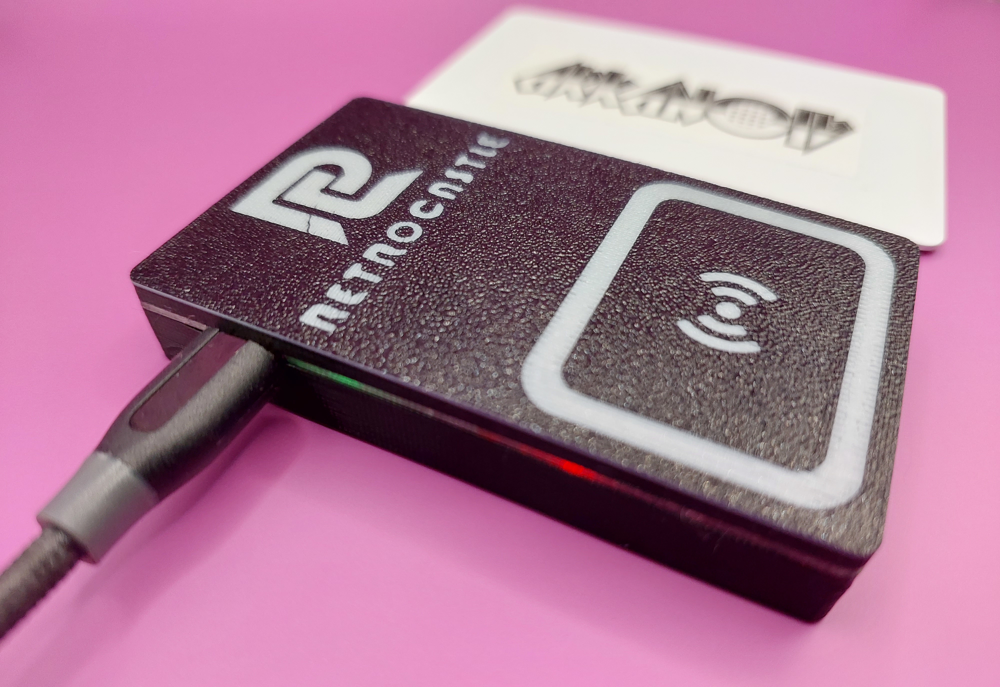

<!-- TOC -->
* [Supplies](#supplies)
* [Serial PCB](#serial-pcb)
* [Case](#case)
* [Assembly](#assembly)
* [Usage](#usage)
<!-- TOC -->

## Credits

- [RetroCastle](https://www.aliexpress.com/store/912024455) - designing the
  serial PCB and releasing it under an open source license.
- [wizzo](https://www.patreon.com/wizzo) - designing the case and writing this
  guide.
- [symm](https://github.com/symm) - starting the [nfc](/docs/nfc.md) project 
  and writing all code that interfaces with the scanners.
- [sigboe](https://github.com/sigboe) - creating the
  [nfcui.sh](/scripts/nfcui/nfcui.sh) script.
- [Retro Frog](https://www.printables.com/@RetroFrog) - advice for the
  case design.

## Supplies

### Equipment

- Soldering iron
- Solder
- Flux
- 3D printer

Unfortunately some soldering is necessary to attach the header pins that
connect the serial board to the NFC module. It only requires 8 through-hole
solders though, so it's a great way to start for a beginner.

Access to a 3D printer is required for color switching to show the top markings
and LED window, but it's also possible to use a 3D printing service and print
in one color.

### Parts

Feel free to shop around for components.

- [PN532 NFC module](https://www.aliexpress.com/item/1005001792108376.html) - 
  any supplier will do but must be a "PN532" module.
- [2.54mm right angle female 4-pin header](https://www.aliexpress.com/item/32980998451.html) -
  attaches to the serial board.
- [2.54mm right angle male 4-pin header](https://www.aliexpress.com/item/32908642552.html) -
  LIKELY OPTIONAL - attaches to the PN532 module but most modules come with one.
- 3D printing filament - if printing yourself, PLA or PETG is fine. A single
  case uses approximately 20g of filament.

## Serial PCB

This is a custom PCB which allows the PN532 to communicate with the MiSTer over
a serial USB connection. It functions the same as a standard USB to serial
cable/adapter, but has a better form factor for use in a case and does not risk
incorrect voltage issues that have been found in these adapters.

This section will explain how to order the PCB from
[JLCPCB](https://jlcpcb.com/), but any PCB manufacturer will work.

### Upload gerber file

From the [JLCPCB](https://jlcpcb.com/) home page, click the "Add gerber file"
button and upload the [Gerber.zip file](diyscanner/pcb/Gerber.zip) from
this repo. You'll be forwarded to the order page.

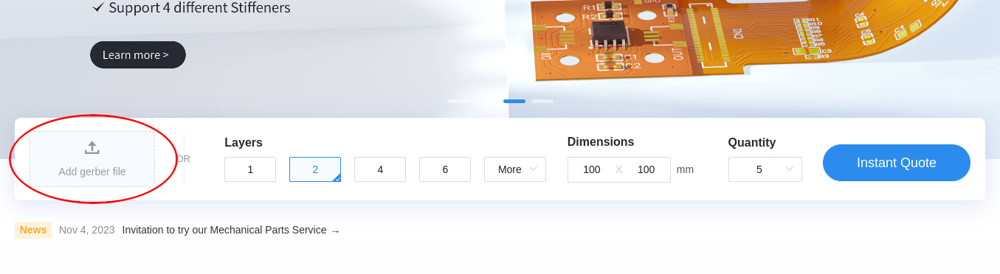

### Beginning order

Scroll down to the "PCB Assembly" section and enable this option with the side
toggle. Otherwise, leave all options as default and click "NEXT" on the right
sidebar.

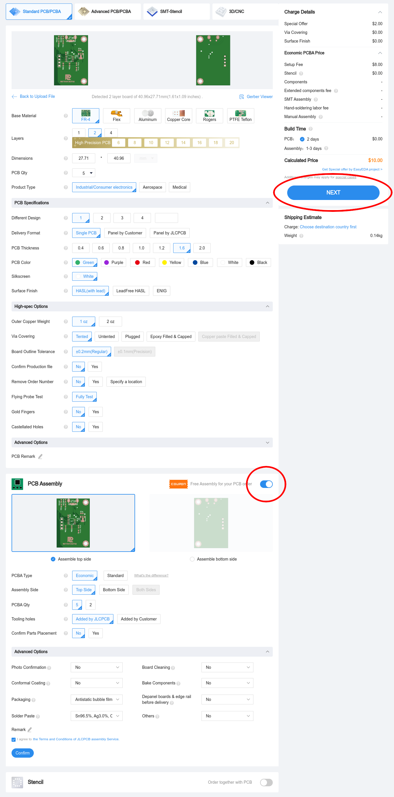

### Board confirmation

Just click "NEXT" on this page.

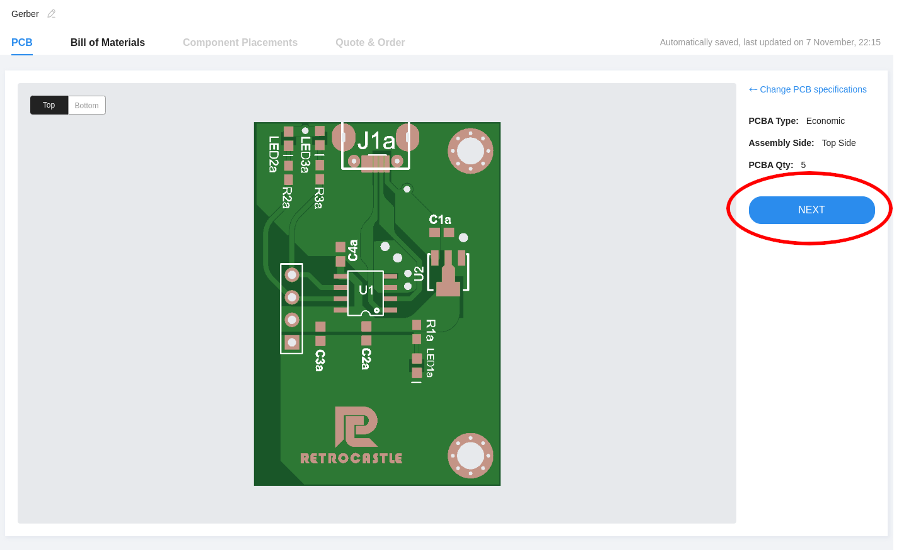

### Upload BOM and CPL files

Upload the [BOM-JLCPCB.xlsx file](diyscanner/pcb/BOM-JLCPCB.xlsx) in the
left file picker (BOM) and the
[PickPlace-JLCPCB.xlsx file](diyscanner/pcb/PickPlace-JLCPCB.xlsx) in the
right file picker (CPL). Then click the "Process BOM & CPL" button.

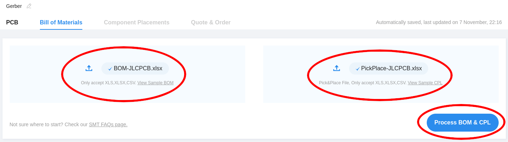

You may receive an error about the "J2 designator" as seen below. Ignore this
and press "Continue". This is referring to the female header pins which you
will solder yourself later.

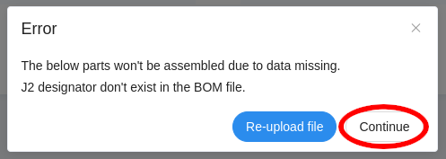

### Bill of materials

There should be nothing to do on this page, just click "NEXT".

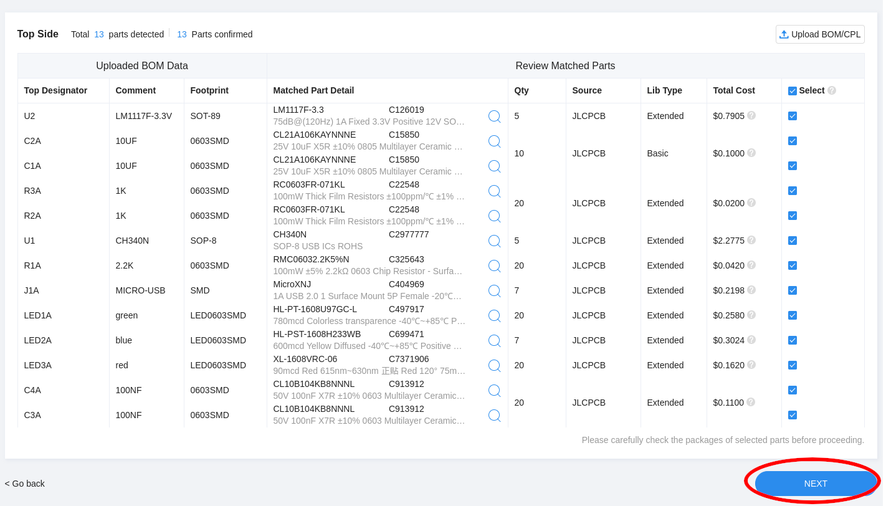

### Component placements

You may see the error below when this page loads, just click "Ok". You can
make sure the components aren't obviously in the wrong place, but it should be
ok to just click "NEXT" here too.

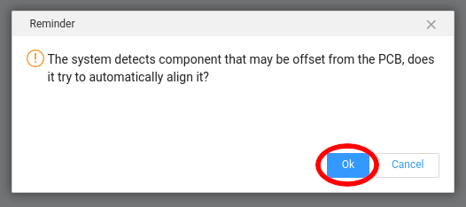

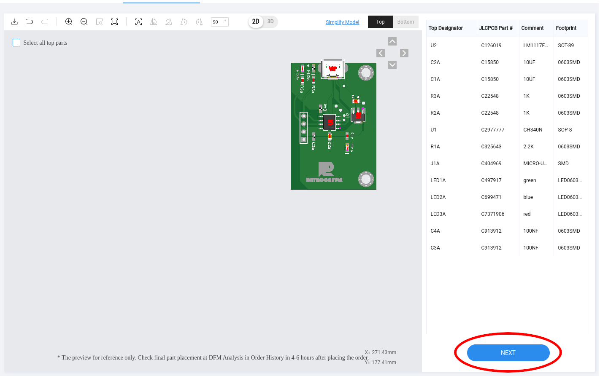

### Quote & order

Select a "Product Description" option. Something like "DIY" is fine. Then click
"SAVE TO CART".

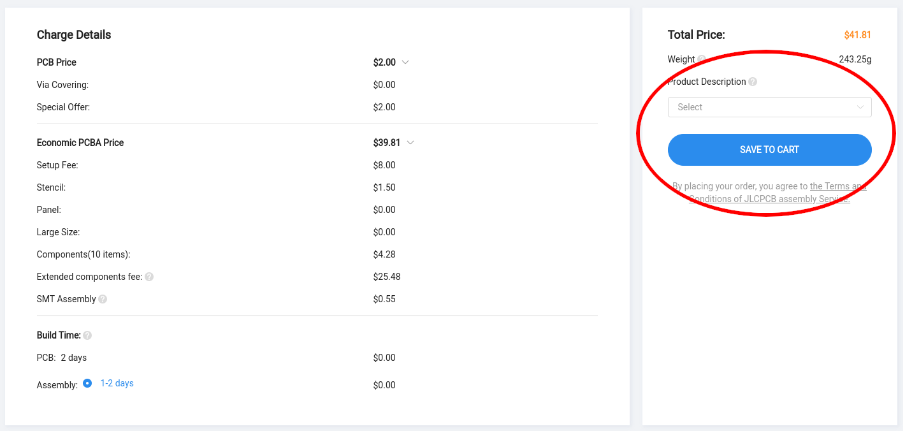

### Checkout

From here, just follow the prompts to specify shipping and payment for your
boards. You can also change the quantity of boards here.

And that's it. When your boards arrive you're ready for assembly.

## Case

The case is 3D printed in two parts, the top and bottom. Each part snaps
together, no other assembly or parts are required.

Download STL files:
- [Top](diyscanner/case/NFCMicroUSBTop.stl)
- [Bottom](diyscanner/case/NFCMicroUSBBottom.stl)

Print each part with a 0.2mm layer height. PLA and PETG have both tested
working fine. It requires approximately 20g of filament.

If you want to make the markings on the top piece more visible, you can print
it in two colors. Print the first layer in one color, print layers 2 and 3 in
a contrasting color, then print the rest in the original color.

Another option to make the LED lights visible is to print the layers around the
USB port in a translucent filament.

It has not been tested, but it should also be no problem to use a 3D printing
service to print the case. You may have to request multiple cases to reach the
minimum size requirements of the service.

## Assembly

Assembly does not take long, but does require a small amount of soldering.

### Soldering

First, solder the female 4 pin header to the serial PCB, as shown in the image
below. Make sure the plastic casing is flush with the PCB.

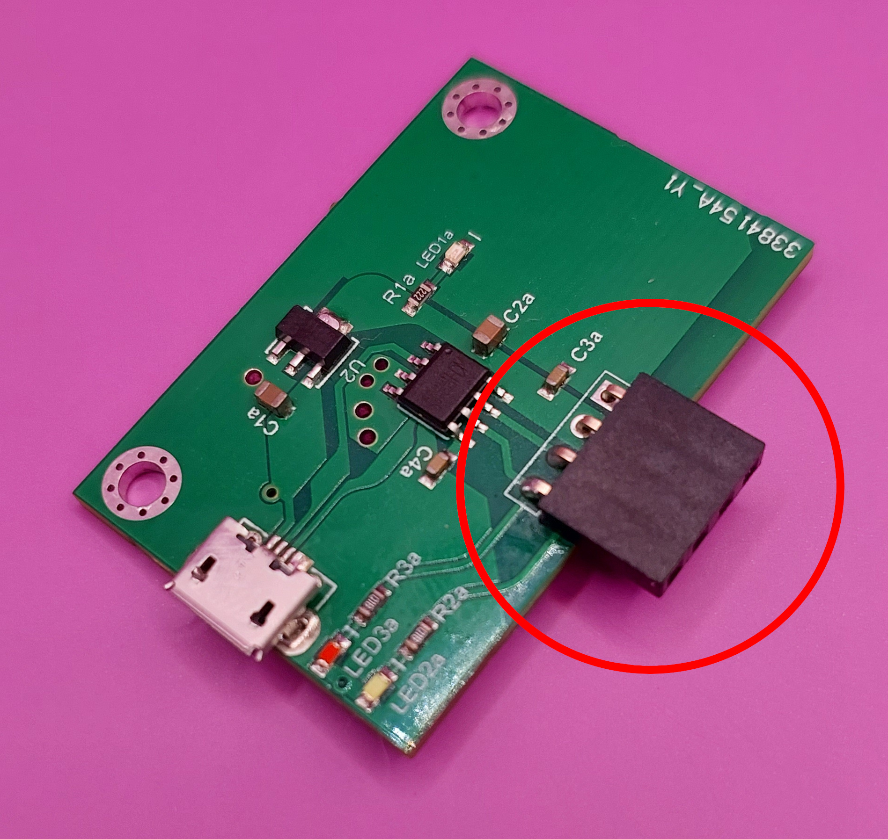

Next, solder the male 4 pin header to the PN532 module. See the image below, it
needs to be soldered into the part with only 4 holes, not the side with 8 holes.

It's important that this one goes on straight too, and it can be a little
tricky to get right. You can hold one edge straight with your nail or helping
hands, then solder the opposite side. Kapton tape may also help to hold it in
place.

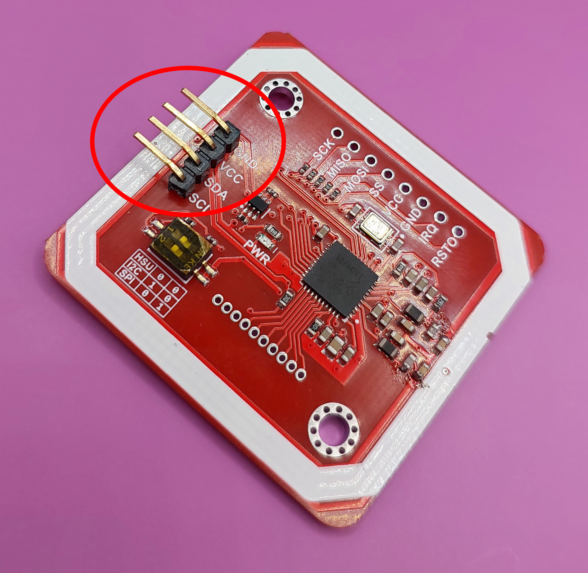

_If you touch the male pins at any point, make sure to give them a quick clean
with alcohol. This can affect the connection to the module._

Lastly, check the DIP switches on the PN532 module, next to the connector you
just soldered. They should be set to "HSU". Usually this is how the come by
default.

Now you can connect the 2 boards together like shown.

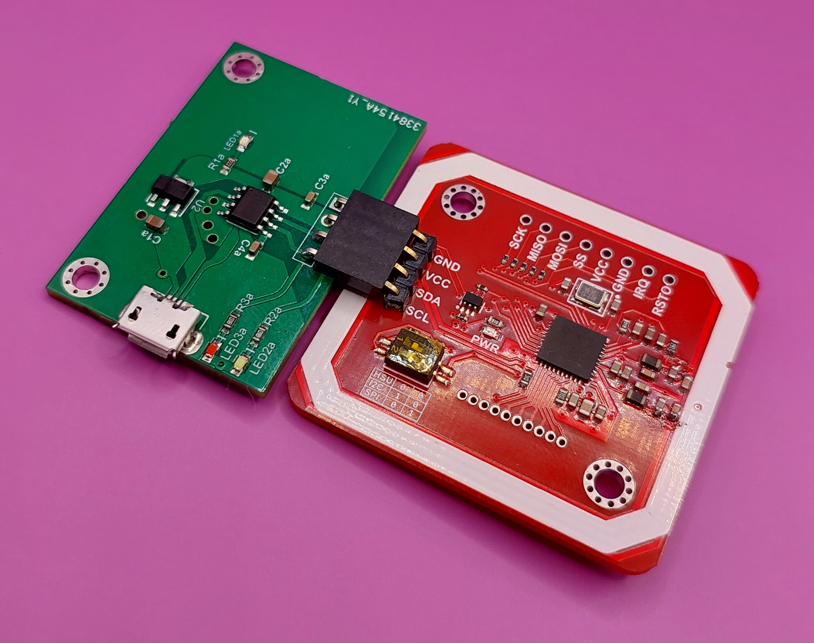

### Case

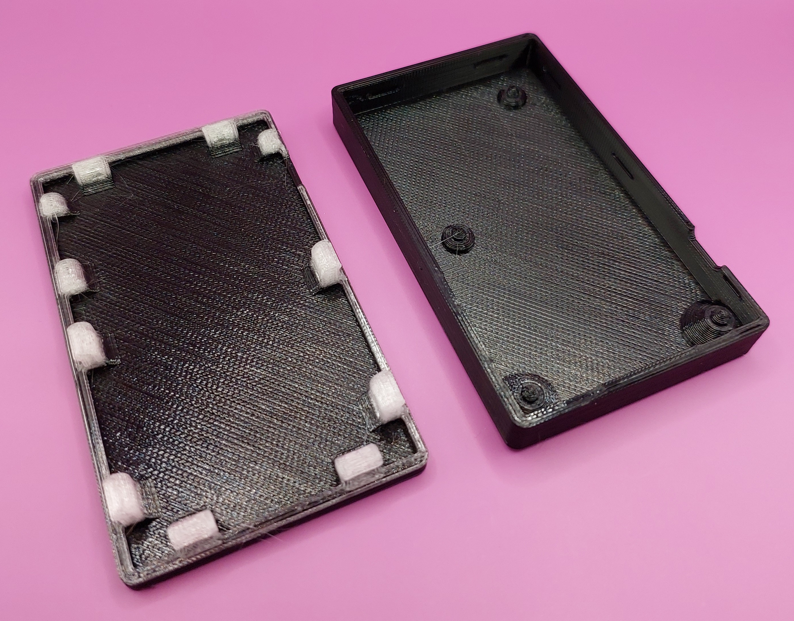

Drop the assembled boards into the bottom half of the case, aligning the
mounting holes with the indentations in the case and the micro USB slot.

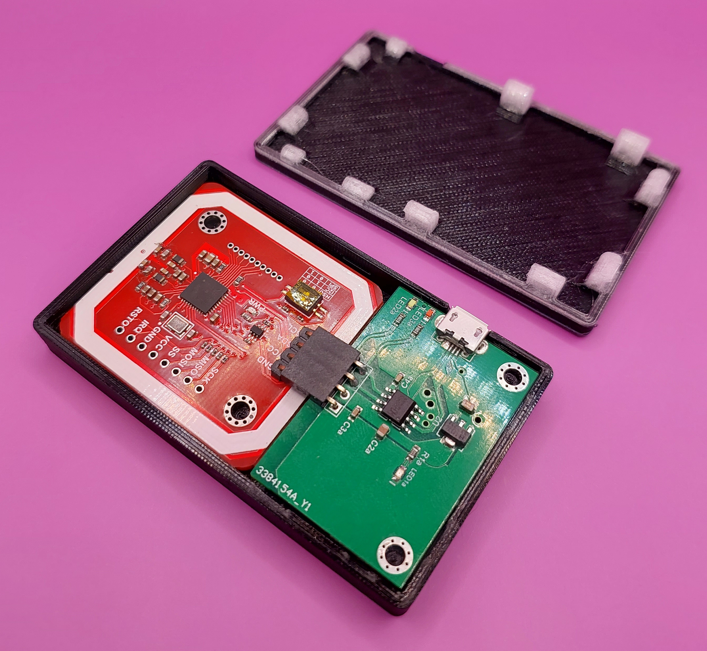

Then, place the top piece on top and push it in place into the bottom
piece. They will snap shut together. It can take a little bit of force to
make them snap together, but it should not be too difficult.

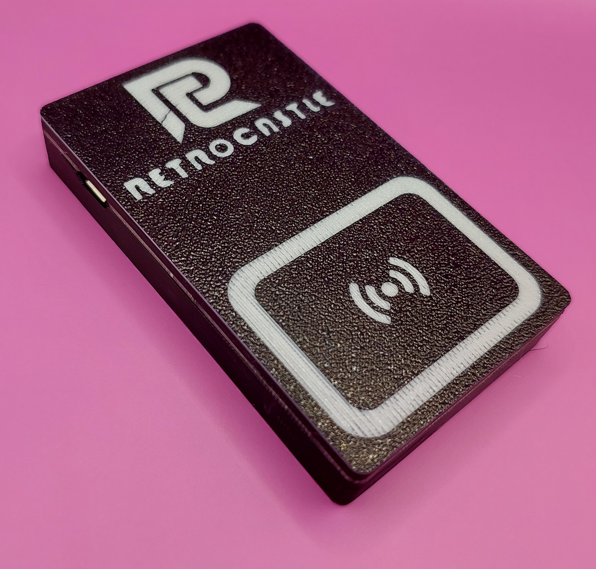

## Usage

Congratulations, you did it! Welcome to the world of tapping a thing on another
thing to make it do a thing.

Please check the [nfc documentation](nfc.md) for configuration
instructions. This scanner should also work without configuration on Windows, Mac and
Linux PCs.

There are 2 ways to scan cards with this scanner. If you want to tap the card,
make sure to align the edge of the card with the square marking on the top of
the case. It can take a little technique at first.

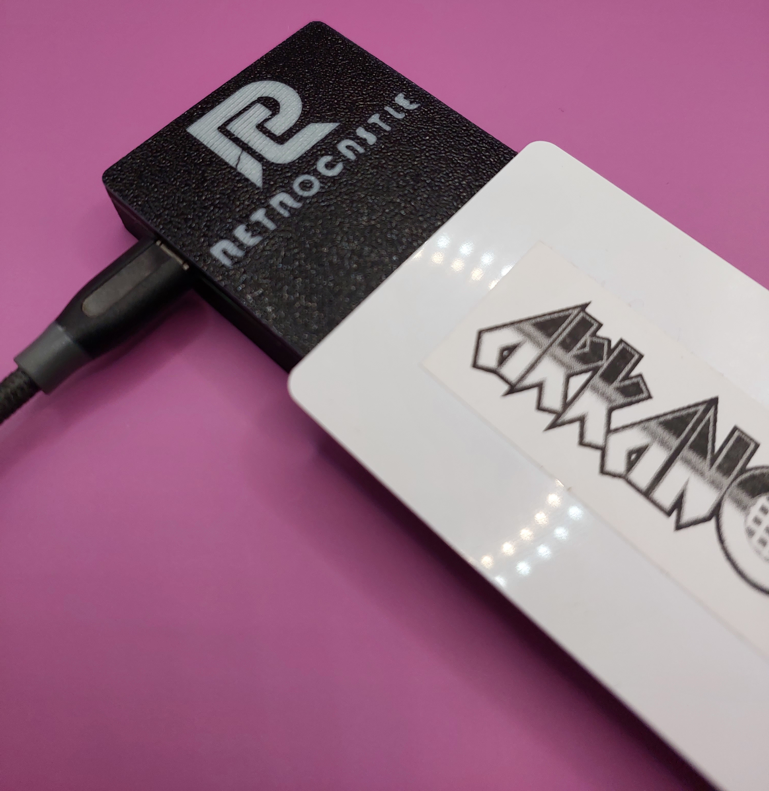

The other option is to just float the card 1-2cm above the scanner. This is
a lot more forgiving on technique than the tap, but usually isn't your first
instinct when trying it out.

Have fun!
